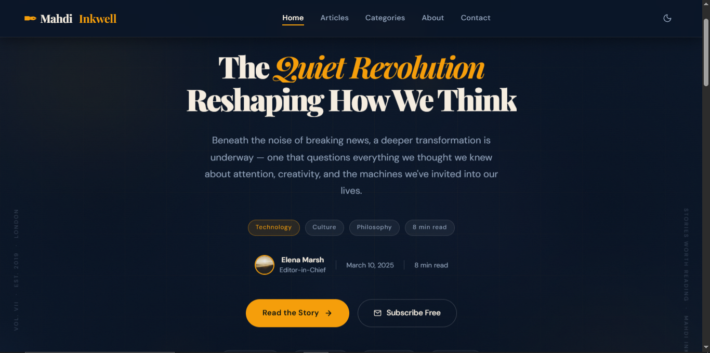

# ✒️ Mahdi Inkwell — Stories Worth Reading

Mahdi Inkwell is a **premium editorial destination** and blog template designed for curious minds. It features a sophisticated design system, smooth motion aesthetics, and a clean reading experience across all devices.



## ✨ Features

- **Premium Design System**: A carefully curated aesthetic using `Playfair Display` for elegance and `DM Sans` for readability.
- **Dynamic Theming**: Seamless transition between **Premium Dark** and **Sophisticated Light** modes.
- **Interactive Experience**:
    - **Custom Loader**: A branded entry experience.
    - **Parallax Hero**: Engaging header with floating orbs and scanline effects.
    - **Cursor Trail**: Subtle interactive element following user movement.
- **Content Organization**:
    - Multi-category support (Technology, Design, Lifestyle, Travel, Business, Science).
    - Functional category filtering.
    - Archive view for all articles.
- **Modern Animations**: Powered by [AOS (Animate on Scroll)](https://michalsnik.github.io/aos/) for a refined feel.
- **Ready-to-Use Sections**:
    - About Page & Bio section.
    - Newsletter Subscription UI.
    - Contact Form with success states.
    - Trending Topics & Social integration.

## 🛠️ Tech Stack

- **Core**: HTML5, CSS3 (Vanilla), JavaScript (Vanilla)
- **Icons**: [Lucide Icons](https://lucide.dev/)
- **Animations**: [AOS (Animate on Scroll)](https://michalsnik.github.io/aos/)
- **Typography**: [Google Fonts](https://fonts.google.com/)

## 📂 Project Structure

```text
├── index.html    # Main structural file (SPA-style layout)
├── blog.css      # Core Design System and animations
├── blog.js       # Interactive logic and navigation
└── LICENSE       # Project licensing
```

## 🚀 Getting Started

1. **Clone the repository**:
   ```bash
   git clone https://github.com/Mahdi-dev110/Mahdi-inkwell.git
   ```
2. **Open the project**:
   Simply open `index.html` in any modern web browser.

No build steps or dependencies are required, as it uses CDN links for external libraries.

## 🎨 Customization

### Colors and Theming
You can easily modify the color palette in `blog.css` under the `:root` and `body.light-mode` selectors.

### Categories
To add or remove categories, update the `categories-filter` and `cards-grid` sections in `index.html`.

## 📄 License

This project is open-source and free to use for personal and commercial projects.[LICENSE](LICENSE)

---

*Crafted with care by Mahdi. Dedicated to stories that linger.*
